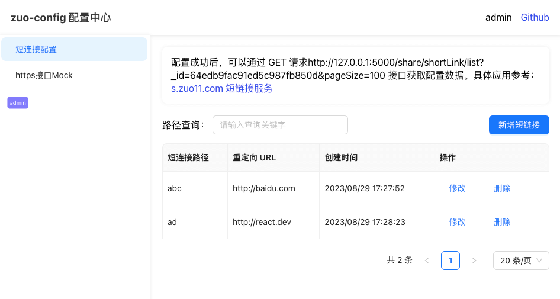
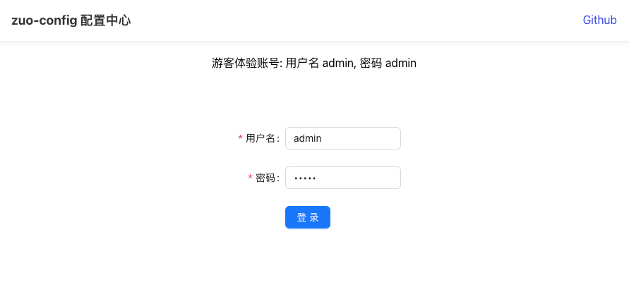
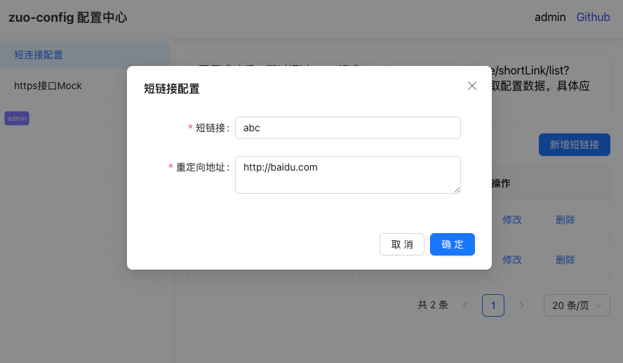
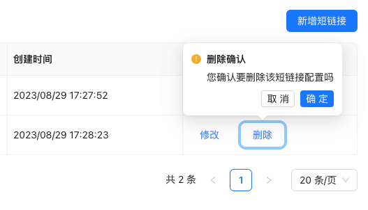

# zuo-config-fe react

Config center frontend part, use React(v18.2) + Antd(v5.8) + React-router(v6.15) + Axios + React-redux

对应接口服务代码仓库：[https://github.com/zuoxiaobai/zuo-config-server](https://github.com/zuoxiaobai/zuo-config-server)



## 功能列表

- [x] 顶部菜单 + 左侧菜单 + 右侧主内容区域
- [x] 登录页 + 表单校验
- [x] 短连接配置 table 页面、分页
- [x] 新增、编辑、删除逻辑 + 弹窗、删除确认
- [x] axios 封装、鉴权拦截
- [x] redux 存储账号登录信息

```bash
npm run start
```

登录鉴权



新增、修改



删除确认



